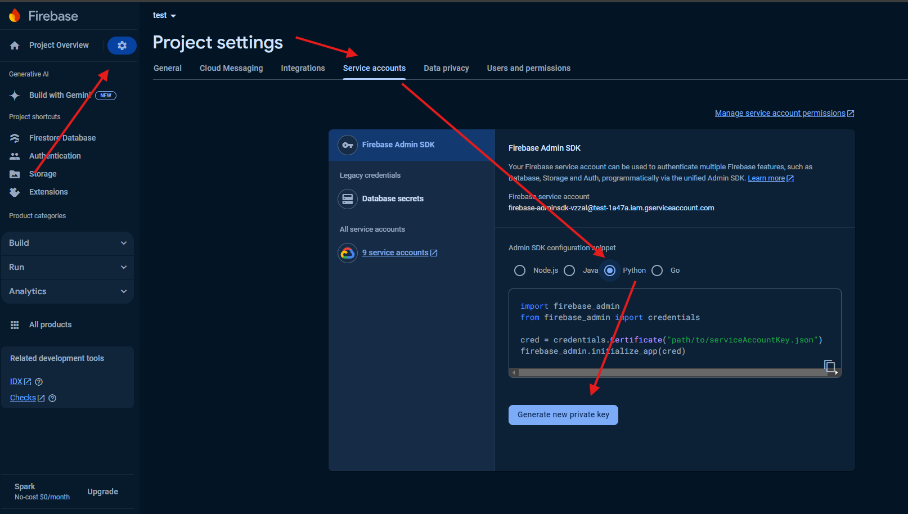
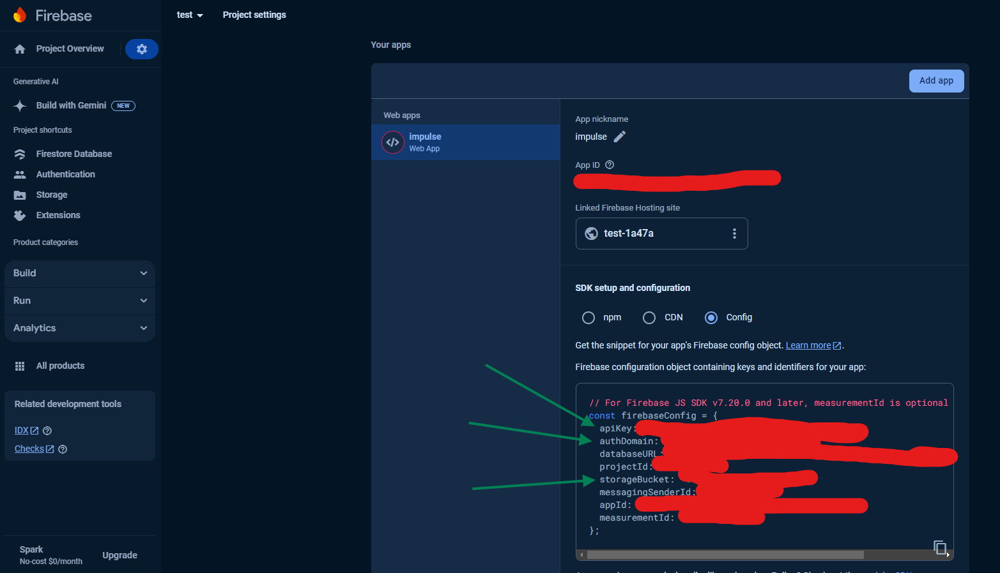

# Инструкция


1. Создать папку **env** c файлом **.test.env** в корне проекта
2. Скачать из Firerbase credentials для базы данных
    
3. Полученные credentials поместить по пути `src/pkg/firebase_tools/keys/` предварительно создав папку **keys** и переименовать файл в **cred_test.json**
4. Заполнить файл **.test.env** как на шаблоне:
   ```
    PROJECT_NAME="<Название приложения>"
    MAIL_USERNAME="<Email, для отправки почты>"
    MAIL_PASSWORD="<Пароль от приложения, для отправки почты>"
    MAIL_PORT=587
    MAIL_SERVER="smtp.gmail.com(можно использовать другой по желанию)"
    MAIL_USE_TLS=1

    CRED_PATH=src/pkg/firebase_tools/keys/cred_test.json

    FB_URL="<домен для авторизации Firebase(добавить https:\\)>"

    FB_BUCKET="<адрес хранилища Firebase>"
    FB_API_KEY="<Api ключ Firebase>"
    
    CELERY_BROKER_URL="redis://redis:6379/0"
    CELERY_RESULT_BACKEND="redis://redis:6379/1"
    CELERY_EAGER=0
   ```
   Необходимые данные Firebase на вкладе General в Project settings:
    
5. Поменять название env-файла в **config.py** по [пути](src/configuration/config.py)
   ```
    model_config = SettingsConfigDict(env_file=os.path.abspath("env/<название env файла который мы содавали в папке env>"))
    ```
    
6. Запуск приложение:
     ```bash
    docker-compose build
    ```
    ```bash
    docker-compose up -d
    ```
   Веб-приложение будет доступно по адресу http://127.0.0.1:8000/pages/login/